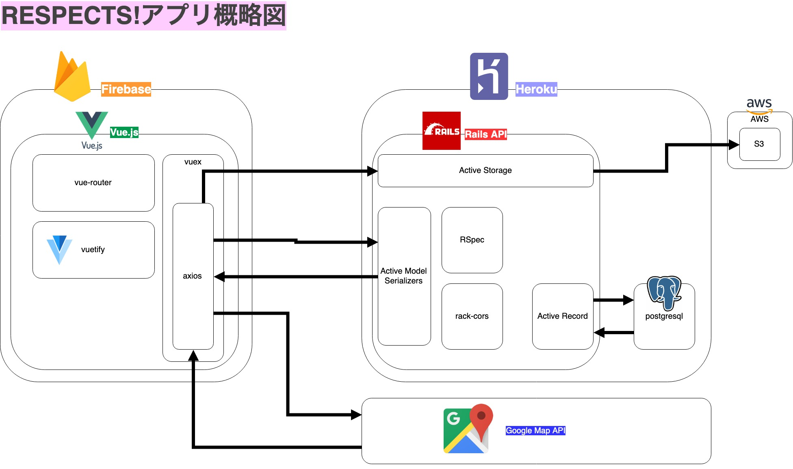

# Respects! 地図に感謝と応援を残そう！
> [RESPECTS!サイト](https://respects-3b626.firebaseapp.com/about)

#### 以下アプリ概略です。 5/15にリリース出来ました。

- フロント => Vue.js, Vuex, Vue-router, axios, Vuetify, Firebase
- バック => Rails API, Active Model Serializer, pundit rack-cors, Heroku

**開発記録はこちらにまとめました**
> [自作アプリRESPECTS!の開発記録](https://www.wantedly.com/users/100781197/post_articles/169707)

## Overview 

**なぜこのアプリを作ろうと思ったのか**
> [自作アプリRESPECTS!を作るに至った経緯](https://www.wantedly.com/users/100781197/post_articles/169534)

#### *Respects!*は地図上に*Thanks*(ありがとう)と*Cheer*(頑張れ)を記録することができるWEBアプリです。
- 地図上に「ありがとう」と匿名で書き込めるアプリ。誰への「ありがとう」かは敢えて指定しない。
- 主に接客業をされている方に「ありがとう」と言いたい事が一杯あるけど、なんか恥ずかしいし、相手をびっくりさせてしまうかも。
- 世の中バッドな意見で溢れていて目立つけど、*グッドな意見*が可視化出来てもいいんじゃないかな？と思った。

