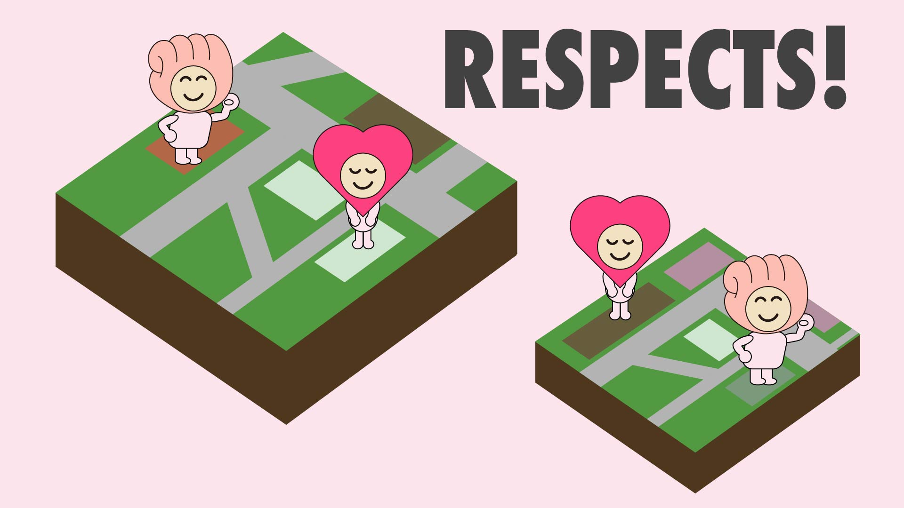
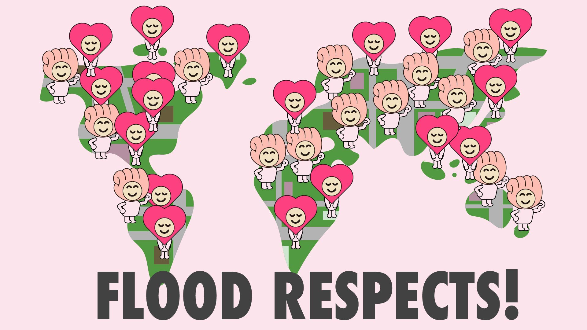

# Respects! 地図に感謝と応援を残そう！

#### 以下使用予定 4/17現在作成中
- フロント => Vue.js, Vuex, Vue-router, axios, Vuetify
- バック => Rails API, Active Model Serializer, rack-cors, ...

## Overview 

#### *Respects!*は地図上に*Thanks*(ありがとう)と*Cheer*(頑張れ)を記録することができるWEBアプリです。
- 地図上に「ありがとう」と匿名で書き込めるアプリ。誰への「ありがとう」かは敢えて指定しない。
- 主に接客業をされている方に「ありがとう」と言いたい事が一杯あるけど、なんか恥ずかしいし、相手をびっくりさせてしまうかも。
- 世の中バッドな意見で溢れていて目立つけど、*グッドな意見*が可視化出来てもいいんじゃないかな？と思った。

